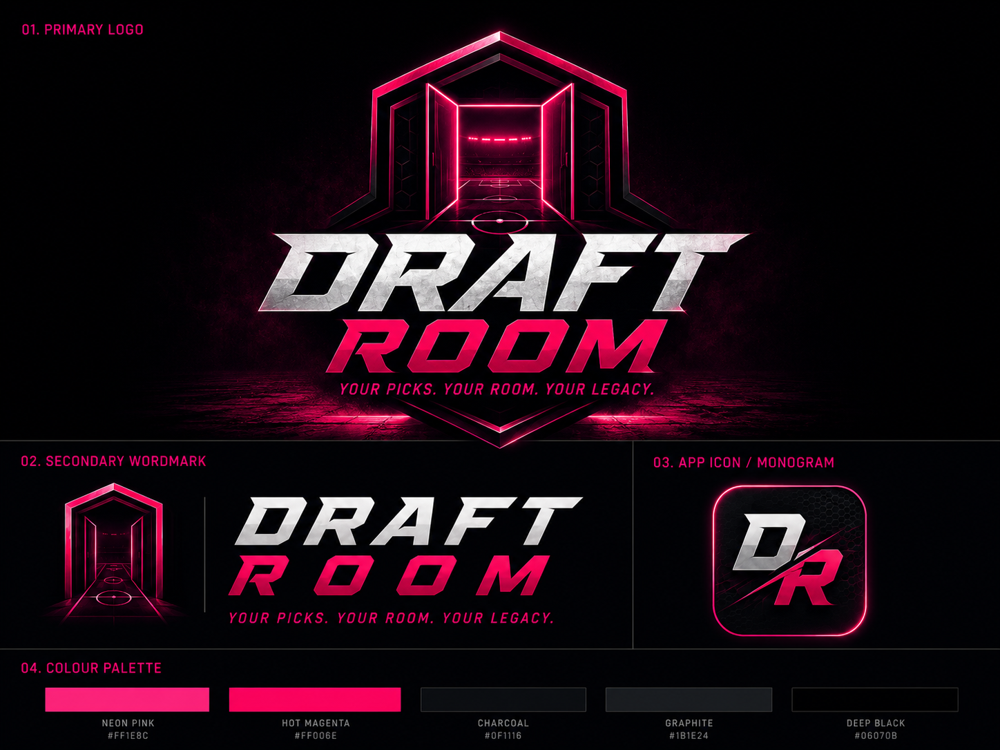

# The Draft Room — Asset Moodboard

## Status

This moodboard is the canonical visual reference for The Draft Room. It supersedes the earlier lime-led and FC Draft Collaborator explorations while preserving the product's premium football-broadcast direction. The source-board lockup reads **Draft Room**; the application uses the approved product name **The Draft Room**.

## Approved direction

- **Brand:** `The Draft Room`
- **Promise:** “Draft together. Win together.”
- **Character:** Vibrant, competitive, live, premium, broadcast, fast, collaborative, immersive.
- **Palette:** Deep Black, Charcoal, Graphite, Neon Pink, Hot Magenta, Electric Violet, and Off White.
- **Typography:** Bold condensed athletic display type with Urbanist for body and interface text.
- **Atmosphere:** Stadium lights, tactical pitch lines, glossy cards, locker-room scenes, crowd energy, and dark premium materials.
- **Interaction style:** Thin outline sports iconography, pink active states, restrained glow, clear timers, and mobile-first controls.

## Usage boundaries

- Use this board for direction and approval context; use the [master design system](../design-system/the-draft-room/MASTER.md) for implementation rules.
- Do not ship cropped elements from the moodboard as production logos, icons, player cards, or backgrounds.
- Production-ready logo and monogram exports live in `public/logo-horizontal.svg` and `public/mark.svg`; favicon and installable-app raster sizes are generated from that monogram.
- Confirm licences for display fonts, player photography, club/league marks, and other third-party football imagery before production use.
